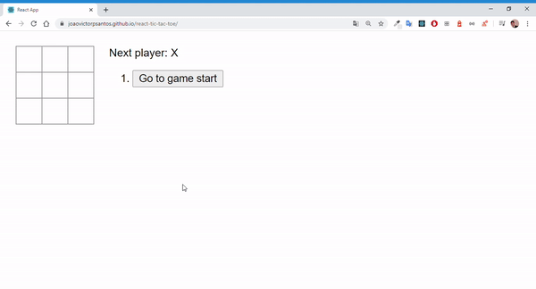

# Jogo da velha com React

> Para ver a aplicação, <a href="https://joaovictorpsantos.github.io/react-tic-tac-toe/">clique aqui</a>.

<a href="https://github.com/joaovictorpsantos">

</a>

<a href="#">

</a>

<a href="https://github.com/joaovictorpsantos/next-level-week-clone/stargazers">

</a>

<a href="https://github.com/joaovictorpsantos/next-level-week-clone/network/members">

</a>

<a href="#">

</a>

<a href="https://github.com/joaovictorpsantos/next-level-week-clone/commits/master">

</a>

<br/><br/>
<div style="display:flex">

</div>
</h2>

<blockquote align="center">
  Esse projeto é open-source, contribua você também :D
</blockquote>

<hr/>

## 💡 Sobre o projeto:

Desenvolvi esse projeto com o intuito de estudar mais sobre os fundamentos do React para poder entender bem as bases para poder construir mais projetos de forma consciente e com boas práticas. Esse projeto é bom base no tutorial da <a href="https://pt-br.reactjs.org/tutorial/tutorial.html">documentação oficial do React</a>. Para testar o projeto, <a href="https://joaovictorpsantos.github.io/react-tic-tac-toe/">clique aqui</a>.

## 🔥 O que aprendemos?

Através dessa aplicação pratiquei mais sobre:

- Criação de componentes no formato de classes
- Criação de componentes no formato de funções
- Propriedades
- Estado
- Imutabilidade
- Boas práticas

## ⚙️ Techs:

- React
- JavaScript

## ⛏ Ferramentas:

- [Visual Studo Code](https://code.visualstudio.com/download)

## 🏁 Executar esse projeto:

Para executar esse projeto em sua máquina,
De o clone no repositório:

```bash
$ git clone https://github.com/joaovictorpsantos/react-tic-tac-toe.git
```

Execute esse comando na raiz do projeto para baixar as dependências:

```bash
yarn
```

Logo depois para executar execute:

```bash
yarn start
```

<br/>

<h4 align="center">
  Vamos compartilhar conhecimento e crescer juntos!!!
</h4>

<br/>

---

<h3 align="center">
Autor: <a alt="João Victor Pereira Santos" href="https://github.com/joaovictorpsantos">João Victor Pereira Santos</a>
</h3>

<p align="center">

  <a alt="João Victor Pereira Santos Linkedin" href="https://www.linkedin.com/in/joao-victor-pereira-santos/">
    </a>
  <a alt="João Victor Pereira Santos GitHub" href="https://github.com/joaovictorpsantos">
  </a>
 <a alt="João Victor Pereira Santos Twitter" href="https://twitter.com/_joaovictorps">
  </a>

</p>
